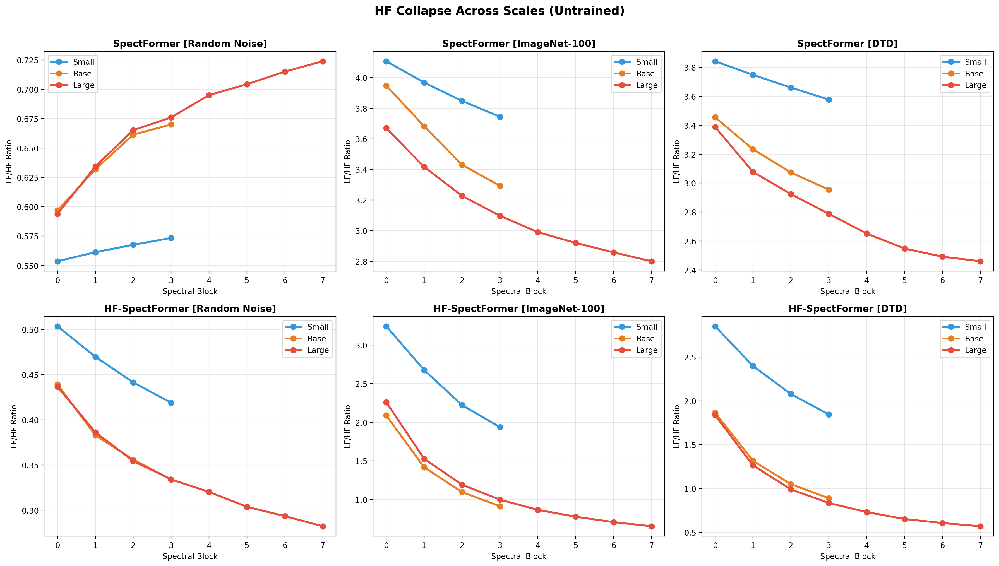
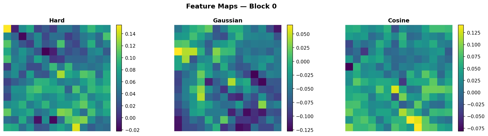
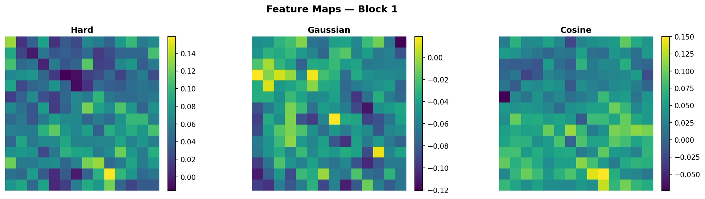
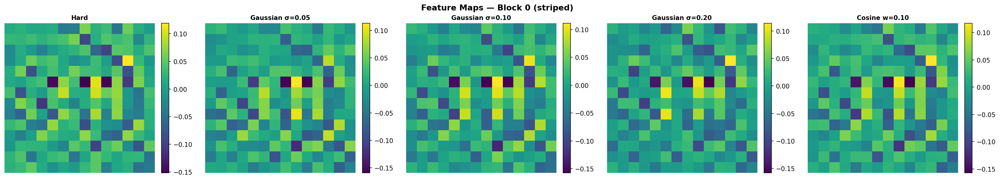
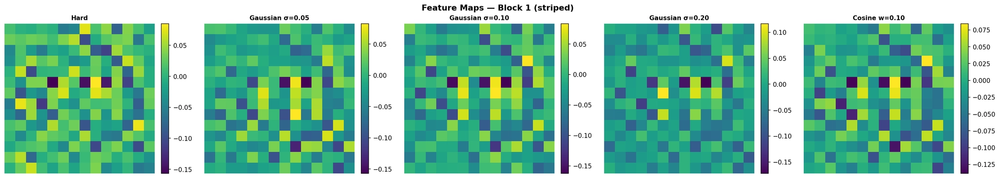
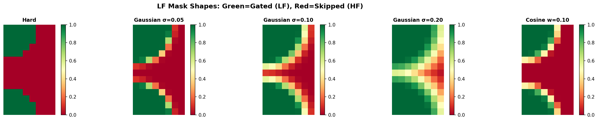
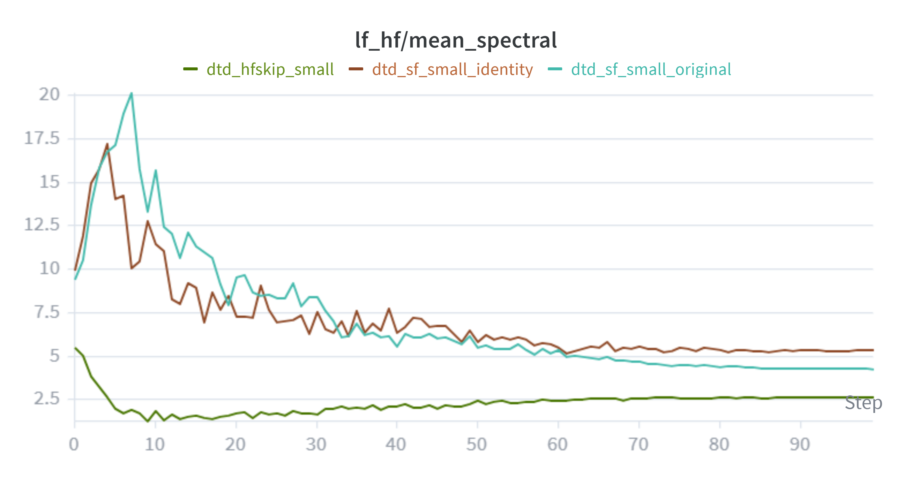
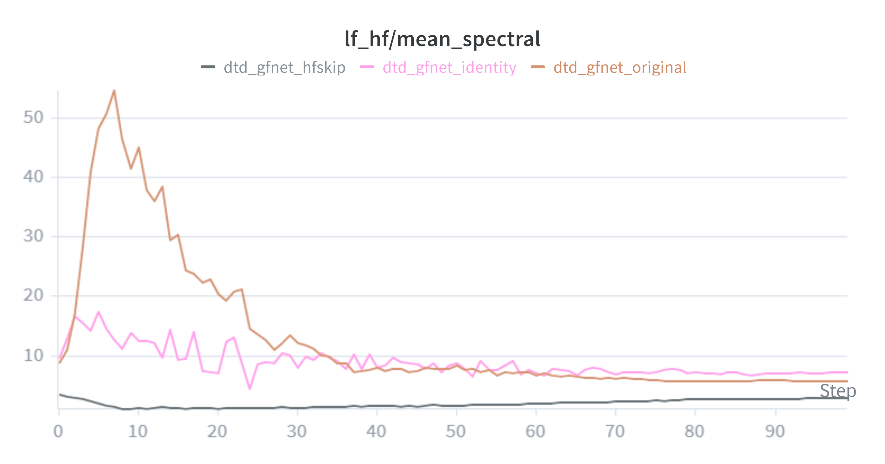

# Supplementary Material for ICML 2026 Submission #27653

**On High-Frequency Collapse in Spectral Vision Transformers**

This repository contains supplementary tables and figures referenced in the author rebuttals.

---

## Table 1: Multi-Seed Evaluation (3 seeds)

### ImageNet-100 (150 epochs)

| Seed | SpectFormer (Top-1 / Top-5) | HF-SpectFormer (Top-1 / Top-5) | Δ Top-1 |
|------|----------------------------|-------------------------------|---------|
| 42 | 82.48 / 95.42 | 83.22 / 96.00 | +0.74 |
| 123 | 82.54 / 95.72 | 84.30 / 96.22 | +1.76 |
| 7 | 82.46 / 95.50 | 83.76 / 95.70 | +1.30 |
| **Mean ± std** | **82.49 ± 0.03** | **83.76 ± 0.44** | **+1.27** |

### ImageNet-100 (100 epochs)

| Seed | SpectFormer (Top-1 / Top-5) | HF-SpectFormer (Top-1 / Top-5) | Δ Top-1 |
|------|----------------------------|-------------------------------|---------|
| 42 | 77.8 / 94.22 | 79.86 / 94.64 | +2.06 |
| 123 | 78.2 / 93.88 | 80.18 / 94.6 | +1.98 |
| 7 | 78.22 / 93.86 | 80.38 / 94.36 | +2.16 |
| **Mean ± std** | **78.07 ± 0.19** | **80.14 ± 0.21** | **+2.07** |

### DTD (100 epochs)

| Seed | SpectFormer (Top-1 / Top-5) | HF-SpectFormer (Top-1 / Top-5) | Δ Top-1 |
|------|----------------------------|-------------------------------|---------|
| 42   | 23.56 / 51.70              | 30.21 / 62.29                 | +6.65   |
| 123  | 20.32 / 48.46              | 30.21 / 61.33                 | +9.89   |
| 7    | 20.43 / 47.07              | 30.37 / 60.96                 | +9.94   |
| **Mean ± std** | **21.44 ± 1.51 / 49.08 ± 1.94** | **30.27 ± 0.08 / 61.52 ± 0.56** | **+8.83** |

*3-seed evaluation under a single consistent environment. Confidence intervals do not overlap on either dataset.*

---

## Table 2: Smooth Mask Ablation

### DTD (100 epochs, seed 42)

| Mask | Test Top-1 | Δ vs Hard |
|------|-----------|-----------|
| Hard (paper default) | 30.21% | baseline |
| Cosine (w=0.10) | 30.43% | +0.22 ≈ same |
| Gaussian narrow (σ=0.05) | 28.62% | −1.59 |
| Gaussian medium (σ=0.10) | 26.33% | −3.88 |
| Gaussian wide (σ=0.20) | 26.86% | −3.35 |

### ImageNet-100 (100 epochs, seed 42)

| Mask | Val Top-1 | Δ vs Hard |
|------|-----------|-----------|
| Hard (paper default) | 81.48% | baseline |
| Cosine (w=0.10) | 81.52% | +0.04 ≈ same |
| Gaussian (σ=0.15) | 81.60% | +0.12 ≈ same |

*Comparison of hard threshold vs smooth transition masks.*

---

## Table 3: Model Efficiency

| Model | Params (M) | Throughput (img/s) |
|-------|-----------|-------------------|
| SpectFormer | 19.66 | 2364.8 |
| SpectFormer + HF-Skip | 19.66 | 2901.1 |
| SpectFormer + ReInit (identity) | 19.66 | 2946.7 |
| GFNet + HF-Skip | 15.62 | 3563.9 |

*Parameter counts and inference throughput for all evaluated model variants.*

---

## Table 4: Initialization Ablation

| Init Mode | DTD Test | ImageNet-100 Val |
|-----------|---------|-----------------|
| Original (random × 0.02) | 22.98% | 82.45% |
| Identity (mag=1, phase=0) | 27.77% | 83.46% |
| Unit magnitude | 27.02% | 83.28% |
| HF-Skip (multi-seed mean) | 30.27% | 83.76% |

### Gap Analysis

| Metric | DTD | ImageNet-100 |
|--------|-----|-------------|
| Identity closes | 65.7% of gap (4.79/7.29) | 77.1% of gap (1.01/1.31) |
| HF-Skip still wins by | +2.50% | +0.30% |

*Comparison of gating weight re-initialization strategies vs HF-Skip on both datasets.*

---

## Table 5: Dense Prediction — Segmentation Results

### Kvasir-SEG (Medical Polyp Segmentation)

| Model | Total Params | Dice | IoU |
|-------|-------------|------|-----|
| GFNet | ~16.87M | 0.6801 | 0.5589 |
| SpectFormer | ~20.92M | 0.7225 | 0.6186 |
| HF-Skip | ~20.92M | 0.7385 | 0.6256 |
| ViT | ~22.94M | 0.7526 | 0.6428 |

### VOC 2012 Segmentation

| Model | Params | mIoU | Pixel Acc | Δ mIoU vs SpectFormer |
|-------|--------|------|-----------|----------------------|
| GFNet | ~16.87M | 0.0998 | 0.7345 | −1.94% |
| SpectFormer | ~20.92M | 0.1192 | 0.7458 | — |
| ViT | ~22.94M | 0.1355 | 0.7530 | +1.63% |
| HF-Skip | ~20.92M | 0.1421 | 0.7605 | +2.29% |

*Segmentation results on Kvasir-SEG (medical) and VOC 2012 (natural images).*

---

## Table 6: Cross-Architecture Validation — GFNet + HF-Skip

All models trained from scratch on ImageNet-100 for 150 epochs with identical hyperparameters.

| Model | ImageNet-100 Top-1 | Δ vs baseline |
|-------|-------------------|---------------|
| GFNet (baseline) | 81.56% | — |
| GFNet + HF-Skip | 84.02% | +2.46 |
| SpectFormer (baseline, multi-seed mean) | 82.49% | — |
| HF-SpectFormer (multi-seed mean) | 83.76% | +1.27 |

*HF-Skip applied to GFNet, a pure spectral architecture without attention layers.*

---

## Table 7: Robustness — 10 Corruption Types (ImageNet-100)

### Gaussian Noise (std dev σ)

| σ | SpectFormer | HF-Skip | ViT | GFNet | GFNet+HFSkip |
|---|------------|---------|-----|-------|-------------|
| 0.08 | 75.1% | **77.0%** | 69.7% | 74.9% | 76.8% |
| 0.12 | 71.2% | 73.1% | 64.9% | 70.8% | **73.5%** |
| 0.18 | 63.9% | 65.1% | 55.3% | 64.7% | **66.7%** |
| 0.26 | 51.2% | 50.2% | 40.5% | **53.0%** | 51.0% |
| 0.38 | 30.2% | 25.9% | 19.5% | **33.0%** | 26.1% |

### Shot Noise (Poisson λ, lower = more noise)

| λ | SpectFormer | HF-Skip | ViT | GFNet | GFNet+HFSkip |
|---|------------|---------|-----|-------|-------------|
| 60 | 75.4% | 76.3% | 69.9% | 74.4% | **77.3%** |
| 25 | 71.0% | 71.7% | 63.4% | 69.8% | **73.1%** |
| 12 | 62.6% | 64.3% | 53.6% | 64.3% | **65.7%** |
| 5 | 46.8% | 44.1% | 35.0% | **50.4%** | 45.6% |
| 3 | 33.3% | 27.9% | 22.4% | **36.3%** | 29.5% |

### Impulse Noise (salt-and-pepper probability p)

| p | SpectFormer | HF-Skip | ViT | GFNet | GFNet+HFSkip |
|---|------------|---------|-----|-------|-------------|
| 0.03 | 70.6% | 71.0% | 64.3% | 70.9% | **72.0%** |
| 0.06 | 62.0% | 62.9% | 55.3% | **65.5%** | 65.3% |
| 0.09 | 55.7% | 55.8% | 47.4% | **60.1%** | 59.3% |
| 0.17 | 40.3% | 40.1% | 33.9% | **47.4%** | 46.6% |
| 0.27 | 26.7% | 23.8% | 23.0% | **33.6%** | 32.4% |

### Defocus Blur (Gaussian radius r pixels)

| r | SpectFormer | HF-Skip | ViT | GFNet | GFNet+HFSkip |
|---|------------|---------|-----|-------|-------------|
| 3 | 47.6% | 46.3% | 41.1% | **50.2%** | 47.3% |
| 4 | 35.6% | 34.1% | 30.6% | **37.1%** | 33.1% |
| 6 | **21.5%** | 21.0% | 18.7% | **21.5%** | 17.3% |
| 8 | 14.9% | **15.3%** | 13.0% | 14.0% | 10.9% |
| 10 | 10.9% | **11.2%** | 9.8% | 9.6% | 7.5% |

### Motion Blur (directional kernel size k pixels)

| k | SpectFormer | HF-Skip | ViT | GFNet | GFNet+HFSkip |
|---|------------|---------|-----|-------|-------------|
| 10 | 66.4% | 66.2% | 61.1% | 67.1% | **67.8%** |
| 15 | 54.8% | 55.1% | 49.8% | **58.5%** | 56.6% |
| 20 | 46.5% | 46.4% | 41.8% | **50.7%** | 48.5% |
| 25 | 40.0% | 38.6% | 35.2% | **43.3%** | 40.2% |
| 30 | 34.8% | 33.1% | 31.0% | **37.9%** | 33.8% |

### Zoom Blur (zoom factor z)

| z | SpectFormer | HF-Skip | ViT | GFNet | GFNet+HFSkip |
|---|------------|---------|-----|-------|-------------|
| 1.11 | **69.8%** | 68.3% | 67.6% | 68.0% | 69.2% |
| 1.16 | **60.8%** | 58.1% | 58.9% | 59.6% | 60.2% |
| 1.21 | **56.6%** | 53.5% | 55.6% | 55.7% | 54.9% |
| 1.26 | **50.6%** | 46.1% | 49.9% | 50.5% | 48.0% |
| 1.31 | **45.0%** | 39.9% | 44.6% | 44.7% | 42.0% |

### Snow

| Parameters | SpectFormer | HF-Skip | ViT | GFNet | GFNet+HFSkip |
|-----------|------------|---------|-----|-------|-------------|
| μ=0.1, σ=0.3, α=0.5 | 69.2% | 70.2% | 64.2% | 70.6% | **71.7%** |
| μ=0.2, σ=0.3, α=0.5 | 66.7% | 68.0% | 61.7% | 68.7% | **70.0%** |
| μ=0.55, σ=0.3, α=0.9 | 35.1% | 33.1% | 28.0% | **41.0%** | 39.0% |
| μ=0.55, σ=0.3, α=0.85 | 38.4% | 36.8% | 30.8% | **43.5%** | 42.4% |

### Frost (image blend α, frost blend β)

| Parameters | SpectFormer | HF-Skip | ViT | GFNet | GFNet+HFSkip |
|-----------|------------|---------|-----|-------|-------------|
| α=1.0, β=0.4 | 75.8% | 78.3% | 73.0% | 75.7% | **78.8%** |
| α=0.8, β=0.6 | 74.3% | 76.7% | 70.5% | 73.5% | **77.1%** |
| α=0.7, β=0.7 | 73.2% | 75.9% | 68.9% | 72.5% | **76.0%** |
| α=0.65, β=0.7 | 73.8% | 76.5% | 69.8% | 72.9% | **76.7%** |
| α=0.6, β=0.75 | 73.0% | 76.3% | 69.0% | 72.2% | **75.8%** |

### Brightness (offset Δ)

| Δ | SpectFormer | HF-Skip | ViT | GFNet | GFNet+HFSkip |
|---|------------|---------|-----|-------|-------------|
| +0.1 | 79.2% | 80.2% | 76.1% | 77.8% | **80.8%** |
| +0.2 | 78.0% | 79.8% | 75.2% | 77.1% | **80.3%** |
| +0.3 | 76.7% | 78.8% | 73.8% | 76.1% | **79.4%** |
| +0.4 | 74.7% | 77.0% | 70.9% | 74.0% | **77.6%** |
| +0.5 | 71.8% | 74.3% | 68.3% | 71.5% | **74.4%** |

### Contrast (scale factor c, lower = less contrast)

| c | SpectFormer | HF-Skip | ViT | GFNet | GFNet+HFSkip |
|---|------------|---------|-----|-------|-------------|
| 0.40 | 75.6% | 77.2% | 71.9% | 74.6% | **78.0%** |
| 0.30 | 74.1% | 76.0% | 70.0% | 73.4% | **76.1%** |
| 0.20 | 70.3% | 72.1% | 66.6% | 71.2% | **73.9%** |
| 0.10 | 56.9% | 59.8% | 54.5% | 63.3% | **67.5%** |
| 0.05 | 35.5% | 38.8% | 32.8% | 44.0% | **50.6%** |

*Top-1 accuracy (%) on ImageNet-100 under 10 corruption types at 5 severity levels each. Bold indicates best performance per row.*

---

## Table 8: FLOPs Comparison

### Model-Level Summary

| Model | Params | GFLOPs | MFLOPs | Δ vs SpectFormer | Δ MFLOPs |
|-------|--------|--------|--------|-------------------|----------|
| SpectFormer | 19.68M | 7.5920 | 7591.96 | baseline | — |
| HF-SpectFormer | 19.68M | 7.5926 | 7592.65 | +0.009% | +0.69M |
| ViT | 21.70M | 8.4904 | 8490.44 | +11.835% | +898.48M |
| GFNet | 15.64M | 5.7950 | 5795.00 | −23.669% | −1796.96M |

### Per-Operation Breakdown (SpectFormer vs HF-SpectFormer)

| Operation | SpectFormer (M) | HF-SpectFormer (M) | Δ MFLOPs | Δ % |
|-----------|----------------|--------------------|---------|----|
| conv | 115.68 | 115.68 | 0 | 0% |
| elementwise_add | 1.58 | 1.75 | +0.17 | +10.88% |
| elementwise_mul | 2.02 | 2.53 | +0.52 | +25.60% |
| fft_irfft2 | 9.96 | 9.96 | 0 | 0% |
| fft_rfft2 | 18.65 | 18.65 | 0 | 0% |
| gelu | 28.90 | 28.90 | 0 | 0% |
| layernorm | 9.41 | 9.41 | 0 | 0% |
| linear | 7405.75 | 7405.75 | 0 | 0% |
| sigmoid | 0.00 | 0.00 | +0.00 | new |
| **Total** | **7591.96** | **7592.65** | **+0.69** | **+0.009%** |

### Source of Overhead

| Op | SpectFormer | HF-SpectFormer | Diff | Expected |
|----|------------|----------------|------|----------|
| fft_rfft2 | 18.65M | 18.65M | 0 | Both 4 calls |
| fft_irfft2 | 9.96M | 9.96M | 0 | Both 4 calls |
| elementwise_mul | 2.02M | 2.53M | +0.52M | HF-Skip has 4×(4 muls) vs 4×(1 mul) = 12 extra muls, but on smaller tensors (masks are sparse) |
| elementwise_add | 1.58M | 1.75M | +0.17M | 4 extra x_lf + x_hf combines |
| sigmoid | 0 | ~0 | ~0 | 4 scalar sigmoid calls |

*HF-Skip adds +0.69 MFLOPs (+0.009%) over baseline SpectFormer. All overhead arises from frequency masking and path recombination.*

---

## Figure 1: HF Collapse Across Scales (Untrained Models)

*Per-block LF/HF ratios for untrained SpectFormer (top) and HF-SpectFormer (bottom) at Small, Base, and Large scales across three input types.*

---

## Figure 2: Feature Map Visualizations

*Feature maps for different mask types on a ImageNet-100 image.*

*Feature maps for different mask types on a DTD texture image.*

---

## Figure 3: Mask Shapes

*LF mask shapes for all five variants. Green = gated (LF), Red = skipped (HF).*

---

## Figure 4: Training Trajectory of LF/HF Ratio

*(a) Mean LF/HF ratio across spectral blocks over training on DTD (SpectFormer, Small scale).*

*(b) Mean LF/HF ratio across spectral blocks over training on DTD (GFNet, Small scale).*

*Note: The x-axis label shows "Step" but corresponds to training epochs (1 step = 1 epoch).*
